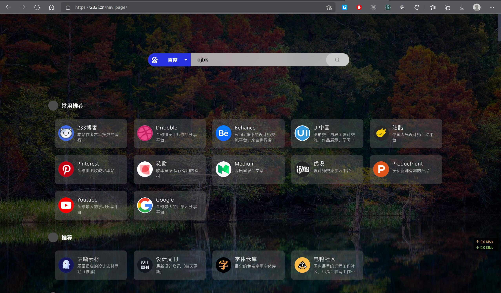

## 项目介绍

导航页使用vue和jquery制作,纯前台版本,无后台,维护比较方便,基本操作和维护解耦(实现中),有很多想做的地方没有时间做,日后慢慢完善,目的就是给小白一个可以自定义,部署简单无需服务器的小项目.有需要的功能欢迎来提
## 使用说明
直接扔文件到gitee page应该就能运行,详情可见下面demo  
### 配置文件
网站配置文件在`data`目录下的`settings.json`文件,在里面可以设置自定义搜索引擎,默认自带6个搜素引擎:`baidu`,`google`,`bing`,`github`,`bilibili`,`zhihu`
### 搜索引擎配置
> 注意搜索引擎接口要把关键词部分替换为%keyword%字段。
模板格式如下:
```json
"baidu": {
    "name": "百度",
    "mainColor": "#2932E1",
    "textColor": "white",
    "icon": "./assets/searchEngineIcons/baidu.svg",
    "api": "https://www.baidu.com/s?wd=%keyword%",
    "advice_func":"baidu_advice"
}
```
`mainColor`:该引擎主题色,`textColor`:文本色(浮于主题色上方)  
注意:若要实现搜索建议功能,请使用jsonp的接口:
1. 编写回调函数,将函数名放入以上配置如:`baidu_advice`
2. 在js目录下增加该函数,需指定两个参数`(keywords,callback)`
例如哔哩哔哩的`实时搜索建议`功能这样编写即可:
```js
function bilibili_advice(keyword, callback) {
    let url = "https://s.search.bilibili.com/main/suggest?func=suggest&suggest_type=accurate&tag_num=10&jsonp=jsonp&callback=sb&term=" + keyword;
    if (window.baidu_advice_ajax) {
        window.baidu_advice_ajax.abort()
    }
    if (keyword === "") {
        callback([]);
        return;
    }
    window.baidu_advice_ajax = $.ajax({
        url: url,
        data: "",
        type: "GET",
        dataType: "jsonp",
        jsonpCallback: "sb",
        success: function (data) {
            let temp_arr = []
            for (const key in data) {
                temp_arr.push(data[key].value)
            }
            callback(temp_arr)
        },
        error: function (e) {
            callback([])
        }
    });
}
```

注意在ajax请求成功后,将关键词作为数组,call一下`callback()`函数就可以了,若请求失败返回空数组`[]`就可以了
### 网站列表配置

首页的网站列表在`data`目录下的`sites.json`文件配置,存放二级分类,子项目格式如下:
```json
{
    "name": "233博客",
    "icon": "./assets/icon.ico",
    "url": "https://233i.cn/",
    "describe": "本站作者常年拖更的博客"
}
```
只需修改这两个文件就可以自定义实用功能.后续会增加更多的功能接口  
### 网页背景
没有单独写进配置文件,默认是跟随bing壁纸每日更新,实用的我服务器上的api,接口地址:https://api.233i.cn/bing/api.php
使用也非常简单,由于服务器那边采用302跳转方式,所以直接加载进`img`标签即可

### 演示demo
**DEMO** => https://233i.cn/nav_page/  
**gitee pages部署**=> https://liuyike233.gitee.io/vue-web-navigation/

### 其他
代码写的比较仓促,欢迎提新功能